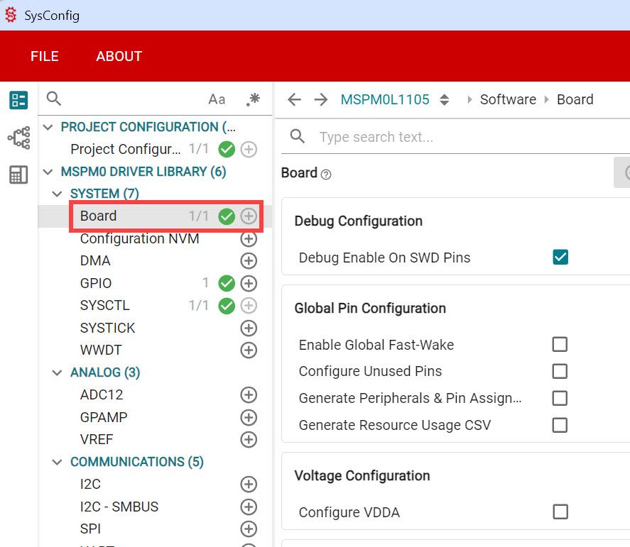
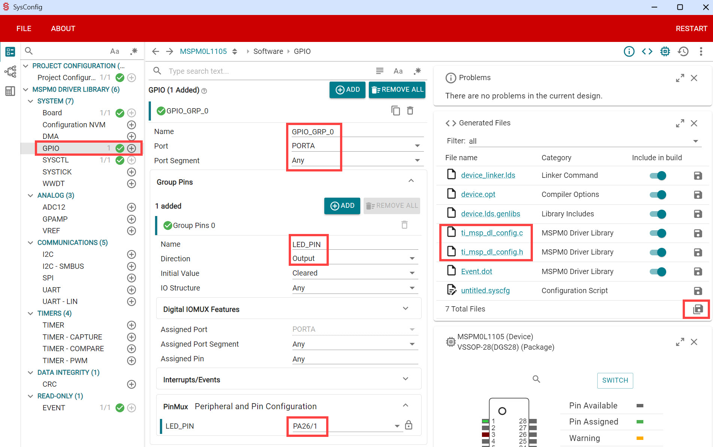

## Summary

MSPM0L1105 starter project with TI DriverLib support.
[DriverLib](https://software-dl.ti.com/msp430/esd/MSPM0-SDK/latest/docs/english/driverlib/mspm0l11xx_l13xx_api_guide/html/modules.html) is a simple low-level API for accessing microcontroller integrated peripherals.

The starter project is called **app_L1105**. If (say) your project is about motor control, you could create a **motor_control** folder, and then drop the app_L1105 folder within it, and simply accept that the app_L1105 name will remain. If you don't want that, you'll have to rename the **app_L1105/keil/app_L1105.uvprojx** file, and also edit the contents of that file, and/or modify the **app_L1105/gcc/makefile** file, depending on if you're building with Keil, GCC, or both. I recommend you keep the app_L1105 name, and simply change the top-level folder name as mentioned.

### Low-Power Recommendations
TI recommends to terminate unused pins by setting the corresponding functions to
GPIO and configure the pins to output low or input with internal
pullup/pulldown resistor.


## Note
The steps here were tested with these combinations:

* Windows with Keil
* Windows with GCC
* Linux with GCC

Other combinations should work, but were untested.

## Setting up your Windows PC
If you're using Windows, download and install the [TI MSPM0 SDK](https://www.ti.com/tool/MSPM0-SDK) in folder **C:\ti** (if you use a different folder, then you'll need to edit some files later, such as app_L1105.uvprojx if you're using Keil, and environment variables if you're using GCC, so it's recommended to initially just use the C:\ti folder if you can). It will install itself into a sub-folder, called something like mspm0_sdk_2_05_01_00. 

If you're using Linux or Mac, the SDK is obtained using a git clone command discussed later.

Next, follow the setting-up steps below depending on whether you're using Keil uVision or ARM GCC.

### Setting up to use Keil
**NOTE:** If the TI MSPM0 SDK folder is *not* precisely called **mspm0_sdk_2_05_01_00** then you'll need to edit the **app_L1105.uvprojx** file (search-and-replace all instances of mspm0_sdk_2_05_01_00 and replace with what you've got).

Download and install and activate [Keil uVision](https://www.keil.arm.com/mdk-community/) (community edition). 

Next, launch uVision and go to **Project->Manage->PackInstaller**, wait for it to refresh over the Internet, and then in the left pane, navigate to **TexasInstruments->MSPM0Series->MSPM0L110X->MSPM0L1105** and click on the name, and then notice that in the right pane, at the top, in the **Pack** column, in the **Device Specific** section, the first entry will be **TexasInstruments:MSPM0L11XX_L13XX_DFP**. In the **Action** column, click on **Install**.

Now you can move on to the **Building with Keil uVision** section.

### Setting up to use ARM GCC on Windows
Download and install the [ARM GNU Toolchain](https://developer.arm.com/downloads/-/arm-gnu-toolchain-downloads). If you're using Windows, then file you need is called something like **arm-gnu-toolchain-13.3.rel1-mingw-w64-i686-arm-none-eabi.zip** but use the latest. You may already have it installed on your PC if you've worked with other microcontrollers (such as Pi Pico RP2040). It will have installed into a folder, such as **C:\Program Files (x86)\Arm GNU Toolchain arm-none-eabi\13.3 rel1**

Open up your Windows Environment Variables, and create two user variables as follows:

```GCC_ARMCOMPILER_MSP   C:\Program Files (x86)\Arm GNU Toolchain arm-none-eabi\13.3 rel1```

```MSPM0_SDK_INSTALL_DIR     C:\ti\mspm0_sdk_2_05_01_00```

You will need to set those variables with your actual paths.

Next, examine your PATH user variable, and see if there's any location suitable for placing a utility application. In my case, I had a folder called c:\users\myusername\.local\bin but if you cannot find anything suitable, then create a path called (say) c:\tools\bin

Go to [EZWinPorts](https://sourceforge.net/projects/ezwinports/files/) and download the file called **make-4.4.1-without-guile-w32-bin.zip** (the number 4.4.1 may be different, that's OK). Open the zip file, and locate **make.exe** (it will be in the **bin** subfolder in the zip file) and place it in your tools folder (**c:\tools\bin** or anywhere else provided it is a folder in your PATH variable).

Now you can move on to the **Building with ARM GCC** section.

### Setting up to use ARM GCC on Ubuntu Linux
Download and install the [ARM GNU Toolchain](https://developer.arm.com/downloads/-/arm-gnu-toolchain-downloads). To do that, you'll need to have downloaded a file with a name like **gcc-arm-none-eabi-10.3-2021.10-x86_64-linux.tar.bz2** (but download the latest) from the ARM website and type the following to install it; there is probably a better way, but this works for now (you'll need to use **su**, or you can prefix each command with **sudo**):

```
su
tar xjf gcc-arm-none-eabi-10.3-2021.10-x86_64-linux.tar.bz2 -C /usr/share
cd /usr/share/gcc-arm-none-eabi-10.3-2021.10
ln -s /usr/share/gcc-arm-none-eabi-10.3-2021.10/bin/arm-none-eabi-gcc /usr/bin/arm-none-eabi-gcc
ln -s /usr/share/gcc-arm-none-eabi-10.3-2021.10/bin/arm-none-eabi-g++ /usr/bin/arm-none-eabi-g++
ln -s /usr/share/gcc-arm-none-eabi-10.3-2021.10/bin/arm-none-eabi-gdb /usr/bin/arm-none-eabi-gdb
ln -s /usr/share/gcc-arm-none-eabi-10.3-2021.10/bin/arm-none-eabi-size /usr/bin/arm-none-eabi-size
ln -s /usr/share/gcc-arm-none-eabi-10.3-2021.10/bin/arm-none-eabi-objcopy /usr/bin/arm-none-eabi-objcopy
apt install libncurses-dev
ln -s /usr/lib/x86_64-linux-gnu/libncurses.so.6 /usr/lib/x86_64-linux-gnu/libncurses.so.5
ln -s /usr/lib/x86_64-linux-gnu/libtinfo.so.6 /usr/lib/x86_64-linux-gnu/libtinfo.so.5
```

Create a development folder. I use a folder /home/MY_USER_NAME/development. Go to that folder, and then type the following to obtain the MSPM0 SDK:
```
git clone https://github.com/TexasInstruments/mspm0-sdk.git
```

Next, edit the MyStarterProject/set_env.sh file (you don't need to keep it at that folder, you can move that file to anywhere convenient) and ensure the paths in there are correct. There are two paths there, one for the ARM GNU Toolchain, and one for the MSPM0 SDK.

Now, whenever you wish to work with the your projects, just remember to go to the folder containing set_env.sh, and type:

```
source ./set_env.sh
```

Now you can move on to the **Building with ARM GCC** section.

## Building with Keil uVision
Launch uVision, and then go to **Project->OpenProject** and then navigate to the **app_L1105** folder, and within that, open the **Keil** folder, and select **app_L1105.uvprojx** in that folder.

The project will open, and you'll see the source code files in the left side Project pane. For instance, the **main.c** file can be accessed by expanding **app_L1105->Source** in that project files tree.

To build the code, click on **Project->BuildTarget**.

## Building with ARM GCC (Windows or Linux or Mac)
If you're using Windows, then launch **PowerShell**, otherwise if you're using Linux or Mac, you'll be using a shell (terminal).

(If you're using Linux or Mac, remember to source your set_env.sh file (by typing **source ./set_env.sh"**) from wherever you saved that file).

Navigate to the **app_L1105** folder, and within that, go to the **GCC** folder. 

You'll see a **makefile** in there. Simply type: **make** and the code should build. To remove the outputs, type: **make clean**

## Making use of Integrated Peripherals using TI SysConfig
Although there is [DriverLib documentation](https://software-dl.ti.com/msp430/esd/MSPM0-SDK/latest/docs/english/driverlib/mspm0l11xx_l13xx_api_guide/html/modules.html) it's useful to auto-generate code, either to directly use, or to inspect and reuse as required, using a tool called [SysConfig](https://www.ti.com/tool/SYSCONFIG).

Once you have installed SysConfig, start it up from the command line (for instance, using Windows Powershell), using the following syntax:

```
C:\ti\sysconfig_1.24.2\sysconfig_gui.bat --product "C:/ti/mspm0_sdk_2_05_01_00/.metadata/product.json"  --device "MSPM0L1105" --package "VSSOP-28(DGS28)" --compiler gcc
```

When it starts up, you have to, very importantly, click on Board, so that a green check-mark appears against it. 



Then, you can click on any integrated peripheral further below it, for instance GPIO as shown in the screenshot below, and configure as follows if you want an output pin. Notice on the right side, there are two files listed called ti_msp_dl_config.c and ti_msp_dl_config.h and those will contain the code you need. Click on the all files icon and save all to any folder, then you can explore those two files.



From the .c and .h files, it is possible to figure out what to put in the main code. Note that this isn't the way you're supposed to use those files, but for the purposes of this quick example, it will do for now.

## Modifying Stack Allocations
If you're using Keil, open the startup_mspm0l110x_uvision.s file, and there will be an entry there similar to:

Stack_Size      EQU     0x00000400

0x400 (hex) is 1024 bytes in decimal. Change the 0x00000400 size as desired, but you'll also need to change instances of 0x00000400 in mspm0l1105.sct too. The stack is configured in mspm0l1105.sct to start at 0x20001000 (top of 4kBytes of RAM) and grow down to 0x20000c00 (i.e. 1024 bytes size).

Note that statically allocated variables start at the bottom of the RAM, followed by Heap (used for malloc'd space) and this grows up, and it could possibly hit the stack.

If you're using GCC, the current linker file (C:\ti\mspm0_sdk_2_05_01_00\source\ti\devices\msp\m0p\linker_files\gcc\mspm0l1105.lds) doesn't specify a limit to the stack size; it merely starts at 0x20001000 (top of 4kBytes of RAM) and grows down as much as required.
