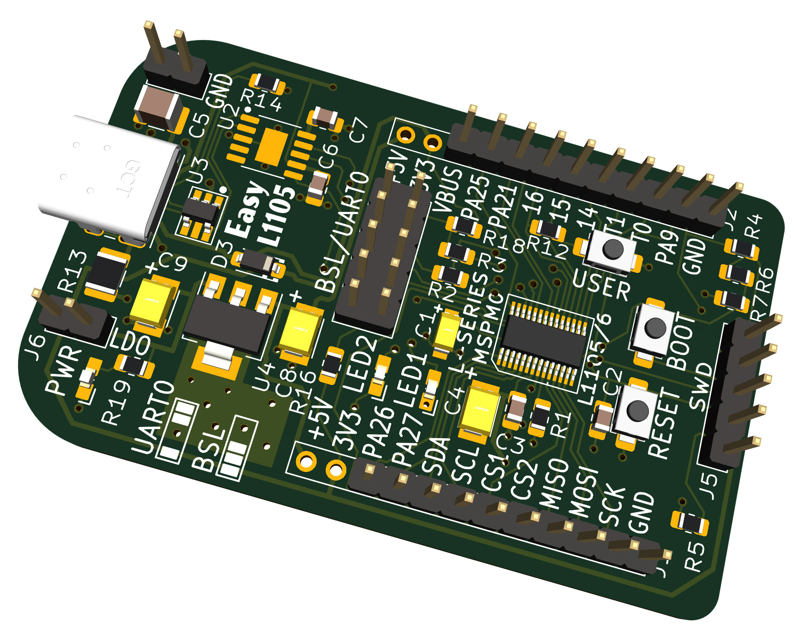
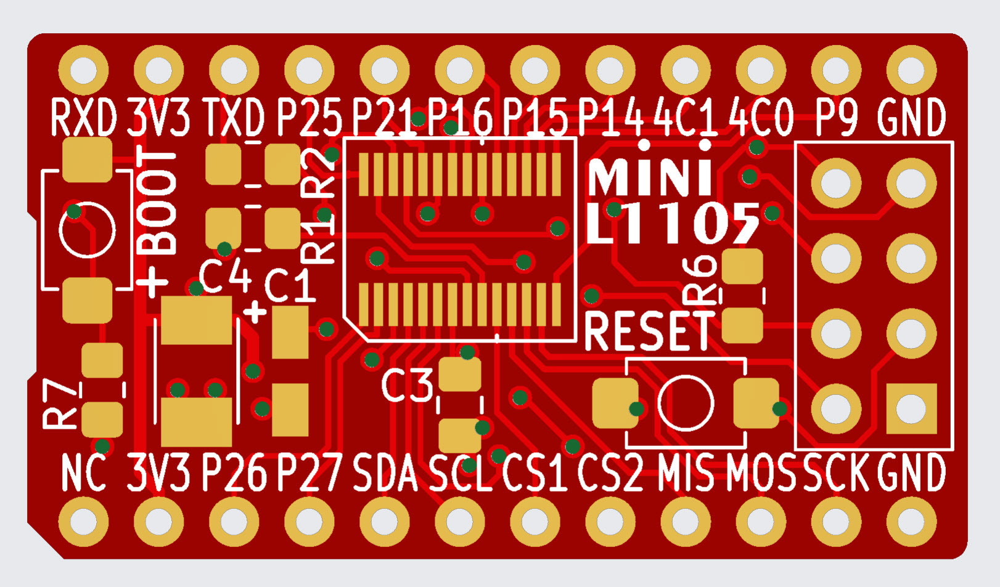
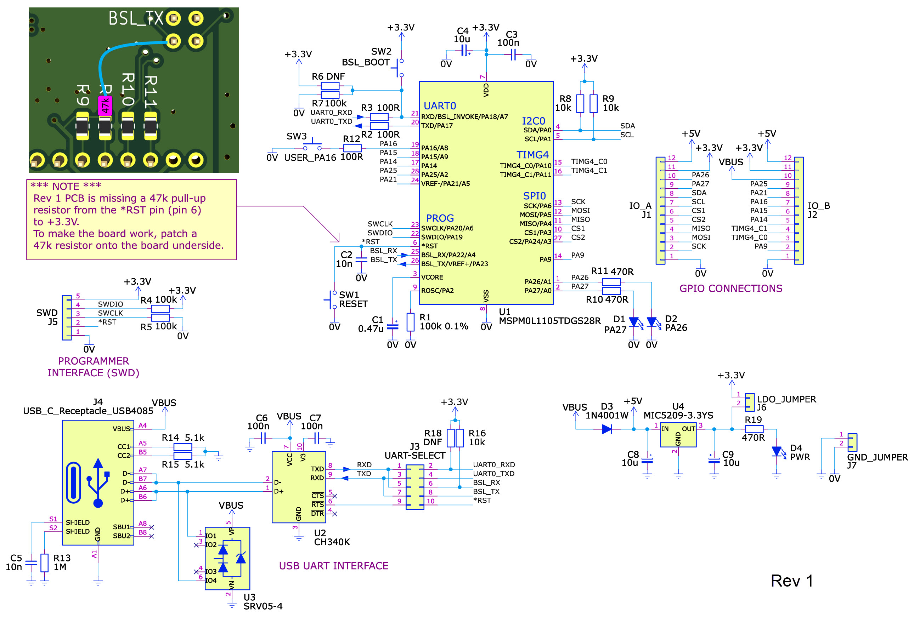
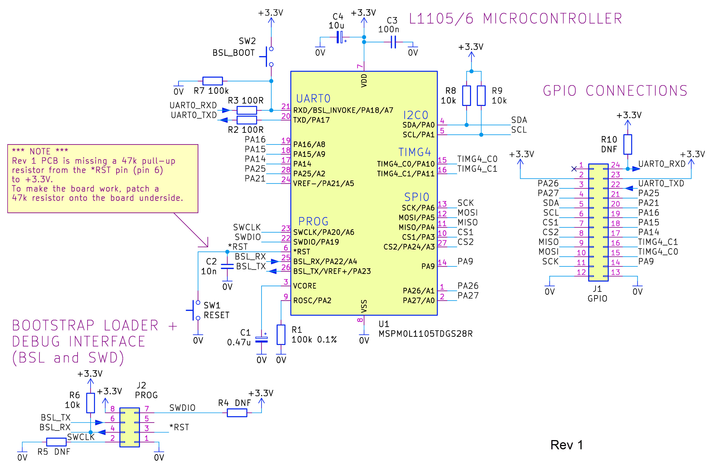
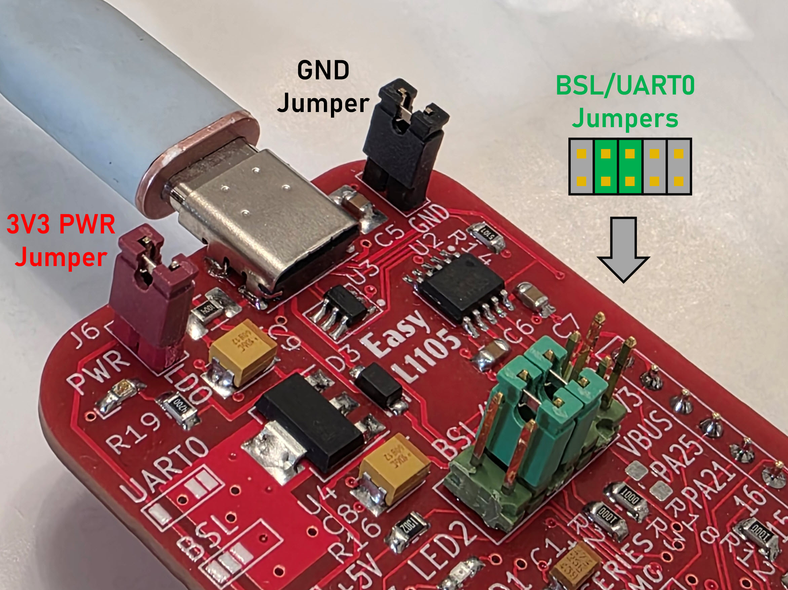
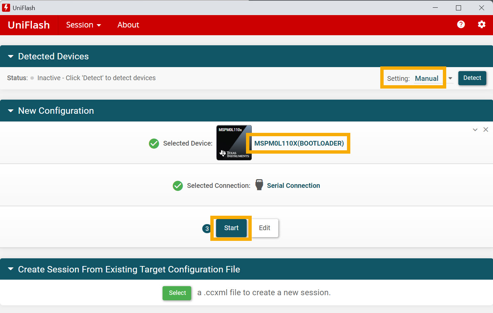
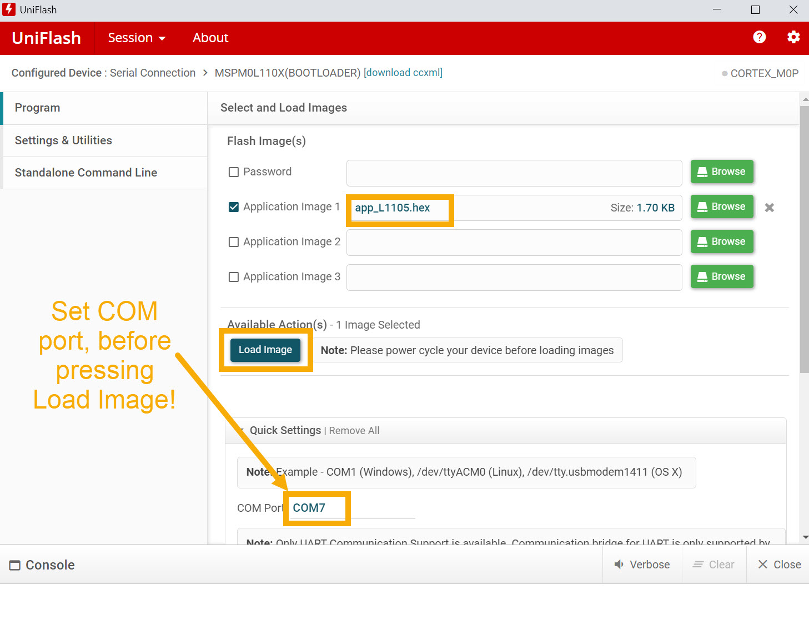

# easyL1105 - What is it?
This repository contains resources for working with the TI MSPM0L1105 Microcontroller.
KiCad files, and Gerber files are present for building a simple development board, called easyL1105. 



The repository also contains Gerber files for a smaller miniL1105 board:



There is also an example starter project, which can be built with Keil or GCC.

# Circuit Diagrams
## easyL1105


## miniL1105


## Note
The Rev 1 easyL1105 and miniL1105 boards have a known bug; they are missing a 47k pull-up resistor from the *RST pin (pin 6 on the microcontroller) to +3.3V. 

The fix is easy, it is possible to patch a resistor onto the underside of the PCB, using an 0805 sized resistor and a short length of 30 AWG Kynar wire.

The Rev 1 board allocates pins PA17(TXD) and PA18(RXD) for UART0, but since PA18(RXD) also has a BOOT function for enabling bootloader mode, there is the unfortunate situation that if the "BSL/UART0" board jumpers are configured to direct UART0 to the USB-UART chip, the pin is in BOOT mode during reset. One workaround for now is to not fit the rightmost jumper (rightmost when the "EasyL1105" and "BSL/UART0" text is the correct way up) during board reboot or power-up, and then fit it later. The better fix will be in Rev 2, where a different GPIO pin will be used in place of PA18(RXD), so that it doesn't clash with the BOOT function

# easyL1105 Parts List
There is a PDF version of the parts list, easyL1105-rev1-parts-list.pdf reproduced here:

| REF                | QTY | VALUE             | DESCRIPTION                                       |
| ------------------ | --- | ----------------- | ------------------------------------------------- |
| C1                 | 1   | 0.47u             | Tant Cap Case A example: T491A474M025AT           |
| C2, C5             | 2   | 10n               | 0805 MLCC Capacitor                               |
| C3,C6,C7           | 3   | 100n              | 0805 MLCC Capacitor                               |
| C4,C8,C9           | 3   | 10u 16V           | Tant Cap Case B example: TAJB106K016RNJ           |
| D1                 | 1   | GREEN             | LED GREEN 0603                                    |
| D2                 | 1   | BLUE              | LED BLUE 0603                                     |
| D3                 | 1   | 1N4001W           | Diode SOD-123                                     |
| D4                 | 1   | PWR               | LED RED 0603                                      |
| J1, J2, J5, J6, J7 | 1   | Header SIL        | Pin Header 2.54mm SIL 40-way (snapped to fit)     |
| J3                 | 1   | 2x5 DIL           | Pin Header 2.54mm DIL 10-way (2x5 way)            |
| J4                 | 1   | USB4085           | Socket GCT USB4805 / XUNPU USB-B10-BRW            |
| R1                 | 1   | 100k 0.1%         | 0805 Resistor 0.1%                                |
| R2,R3,R12          | 3   | 100R              | 0805 Resistor                                     |
| R4,R5,R7           | 3   | 100k              | 0805 Resistor                                     |
| R8,R9,R16          | 3   | 10k               | 0805 Resistor                                     |
| R10                | 1   | 220R              | 0805 Resistor                                     |
| R11                | 1   | 820R              | 0805 Resistor                                     |
| R19                | 1   | 1k                | 0805 Resistor                                     |
| R13                | 1   | 1M                | 0805 Resistor                                     |
| R14,R15            | 2   | 5.1k              | 0805 Resistor                                     |
| SW1, 2, 3          | 3   | Tact Switch       | Tact Button 4x3mm GCT SWT0110                     |
| U1                 | 1   | MSPM0L1105TDGS28R | TI MSPM0 L1105 VSSOP28 DGS                        |
| U2                 | 1   | CH340K            | WCH USB UART IC SSOP-10-1EP                       |
| U3                 | 1   | SRV05-4           | ESD Diode Array SOT23-6                           |
| U4                 | 1   | MIC5209-3.3YS     | LDO 3.3V SOT-223                                  |
| RFIX1              | 1   | 47k               | 0805 Resistor, patched between \*RST and 3.3V     |
| n/a                | 5   | Shorting Jumpers  | Jumpers 2-pin 2.54mm (Red, Black, Green x2, Blue) |


# Example Project
Go into the [**MyStarterProject**](https://github.com/shabaz123/easyL1105/tree/main/MyStarterProject) folder to see an example project called **app_L1105** (and if you plan to use GCC on Linux, then you need the **set_env.sh** file that is also in the MyStarterProject folder; save it to any convenient location). 

Go into the [**app_L1105**](https://github.com/shabaz123/easyL1105/tree/main/MyStarterProject/app_L1105) folder within MyStarterProject, and you'll find README notes explaining how to set up your PC and how to build the code.

If you were creating your own app based on the starter code, then rename the folder MyStarterProject to whatever name you want (for instance, MyLEDProject), and within there, retain the app_L1105 folder name (otherwise, you'd have to modify the contents of IDE files or makefiles). Then, edit the main.c file to do whatever you wish.

# Uploading your Application Firmware to the Microcontroller
Once you have built the example project, you'll want to upload it into the microcontroller. The easyL1105 board has a built-in USB-to-UART adapter. The miniL1105 board will require an external 3.3V logic level USB-UART adapter.

## Set Board Jumpers and Plug into PC
If you're using the easyL1105 board, ensure that two jumpers (green in the photo below) are fitted to direct the USB-UART to **BSL**, and not to UART0. Ensure that the PWR and GND jumpers are fitted (red and black in the photo below).



Attach the board using the USB cable to your PC, and check what port number is associated with it (for example, it may be a number like COM7 if you're using a Windows PC). If you don't see any port, then there may be a fault with the USB-UART circuitry, or an issue with the USB cable perhaps.

## Install and Run UniFlash
Download and install TI UniFlash. Run it, and at the top-right, set **Setting:Manual**. Next, under **Device**, click on **Category:MSP** and then type **MSPM0L110x** and you'll see a selection titled **MSPM0L110X(BOOTLOADER) Serial**. Click to select that.

Next, click on **Start**. 



You'll see a set of boxes appear. Click the empty text entry box to the right of **Application Image 1** and in the file browser that appears, browse to your built firmware file, which will have a **.hex** suffix, for instance, **app_L1105.hex**.

**Don't** press the Load Image button that appears just yet!

Instead, scroll further down, and you'll see a random COM port selected. In that box, type the correct COM port.



## Set Board to Bootloader Mode
Hold down the **BOOT** button on the board, press and release the **RESET** button, then release the **BOOT** button.

## Upload the Firmware
Now you can go back to the **Load Image** button in UniFlash, and press it.

Initially it may take a few seconds (or longer), but eventually you should see output like the following:

```
[21/08/2025, 23:56:17] [INFO] CORTEX_M0P: MSPM0L110x(Bootloader)
[21/08/2025, 23:56:17] [INFO] CORTEX_M0P: Invoking Bootloader....
[21/08/2025, 23:56:18] [ERROR] CORTEX_M0P: Automatic Bootloader invocation failed with response....1
[21/08/2025, 23:56:18] [ERROR] CORTEX_M0P: Try manual Bootloader Invocation...
[21/08/2025, 23:56:19] [INFO] CORTEX_M0P:
[21/08/2025, 23:56:19] [INFO] CORTEX_M0P: BSL Connected
[21/08/2025, 23:56:19] [INFO] CORTEX_M0P: Command Interpreter version: [0x0100] Build ID: [0x0100] Application version: [0x00000000] Active Plugin Interface version: [0x0001] BSL Max buffer size: [0x06C0] BSL Buffer Start address: [0x20000160] BCR Config ID: [0x00000x0001] BSL Config ID [0x00000x0001]
[21/08/2025, 23:56:19] [INFO] CORTEX_M0P: [80] [01] [00] [19] [B2] [B8] [96] [49]
[21/08/2025, 23:56:19] [INFO] CORTEX_M0P: {00}{08} {19} {00} {31} {00} {01} {00} {01} {00} {00} {00} {00} {01} {00} {C0} {06} {60} {01} {00} {20} {01} {00} {00} {00} {01} {00} {00} {00} {49} {61} {57} {8C}
[21/08/2025, 23:56:19] [INFO] CORTEX_M0P: BSL Password is correct!
[21/08/2025, 23:56:19] [INFO] CORTEX_M0P: [80] [21] [00] [21] [FF] [FF] [FF] [FF] [FF] [FF] [FF] [FF] [FF] [FF] [FF] [FF] [FF] [FF] [FF] [FF] [FF] [FF] [FF] [FF] [FF] [FF] [FF] [FF] [FF] [FF] [FF] [FF] [FF] [FF] [FF] [FF] [02] [AA] [F0] [3D]
[21/08/2025, 23:56:19] [INFO] CORTEX_M0P: {00}{08} {02} {00} {3B} {00} {38} {02} {94} {82}
[21/08/2025, 23:56:19] [INFO] CORTEX_M0P: Erasing sectors containing DataBlock starting at 0x0 is successful!
[21/08/2025, 23:56:19] [INFO] CORTEX_M0P: [80] [09] [00] [23] [00] [00] [00] [00] [8F] [02] [00] [00] [34] [27] [34] [14]
[21/08/2025, 23:56:19] [INFO] CORTEX_M0P: {00}{08} {02} {00} {3B} {00} {38} {02} {94} {82}
[21/08/2025, 23:56:19] [INFO] CORTEX_M0P: Erasing memory time elapsed: 0.03107s
[21/08/2025, 23:56:20] [INFO] CORTEX_M0P: [80] [95] [02] [20] [00] [00] [00] [00] [00] [10] [00] [20] [4D] [01] [00] [00] [51] [01] [00] [00] [53] [01] [00] [00] [00] [00] [00] [00] [00] [00] [00] [00] [00] [00] [00] [00] [00] [00] [00] [00] [00] [00] [00] [00] [00] [00] [00] [00] [00] [00] [00] [00] [55] [01] [00] [00] [00] [00] [00] [00] [00] [00] [00] [00] [57] [01] [00] [00] [59] [01] [00] [00] [5B] [01] [00] [00] [5B] [01] [00] [00] [5B] [01] [00] [00] [00] [00] [00] [00] [5B] [01] [00] [00] [00] [00] [00] [00] [00] [00] [00] [00] [00] [00] [00] [00] [00] [00] [00] [00] [5B] [01] [00] [00] [00] [00] [00] [00] [00] [00] [00] [00] [00] [00] [00] [00] [5B] [01] [00] [00] [00] [00] [00] [00] [5B] [01] [00] [00] [5B] [01] [00] [00] [00] [00] [00] [00] [5B] [01] [00] [00] [00] [00] [00] [00] [5B] [01] [00] [00] [00] [00] [00] [00] [00] [00] [00] [00] [00] [00] [00] [00] [5B] [01] [00] [00] [00] [00] [00] [00] [00] [00] [00] [00] [00] [00] [00] [00] [00] [00] [00] [00] [00] [00] [00] [00] [00] [00] [00] [00] [5B] [01] [00] [00] [00] [F0] [02] [F8] [00] [F0] [32] [F8] [0C] [A0] [30] [C8] [08] [38] [24] [18] [2D] [18] [67] [1E] [A2] [46] [AB] [46] [54] [46] [5D] [46] [AC] [42] [01] [D1] [00] [F0] [24] [F8] [7E] [46] [0F] [3E] [B6] [46] [0F] [CC] [01] [26] [33] [42] [00] [D0] [FB] [1A] [33] [43] [A2] [46] [AB] [46] [18] [47] [74] [01] [00] [00] [94] [01] [00] [00] [00] [00] [00] [00] [00] [23] [00] [24] [00] [25] [00] [26] [10] [3A] [01] [D3] [78] [C1] [FB] [D8] [52] [07] [00] [D3] [30] [C1] [00] [D5] [0B] [60] [70] [47] [1F] [B5] [1F] [BD] [10] [B5] [10] [BD] [00] [F0] [27] [F8] [11] [46] [FF] [F7] [F7] [FF] [00] [F0] [59] [F8] [00] [F0] [3F] [F8] [03] [B4] [FF] [F7] [F2] [FF] [03] [BC] [00] [F0] [45] [F8] [00] [00] [06] [48] [00] [47] [FE] [E7] [FE] [E7] [FE] [E7] [FE] [E7] [FE] [E7] [FE] [E7] [03] [48] [04] [49] [02] [4A] [04] [4B] [70] [47] [00] [00] [C1] [00] [00] [00] [60] [00] [00] [20] [00] [10] [00] [20] [00] [0C] [00] [20] [70] [47] [70] [47] [70] [47] [75] [46] [00] [F0] [24] [F8] [AE] [46] [05] [00] [69] [46] [53] [46] [C0] [08] [C0] [00] [85] [46] [18] [B0] [20] [B5] [FF] [F7] [E1] [FF] [60] [BC] [B6] [46] [00] [26] [00] [27] [C0] [C5] [C0] [C5] [C0] [C5] [C0] [C5] [C0] [C5] [C0] [C5] [C0] [C5] [C0] [C5] [40] [3D] [49] [08] [49] [00] [8D] [46] [70] [47] [10] [B5] [04] [46] [C0] [46] [C0] [46] [20] [46] [FF] [F7] [BA] [FF] [10] [BD] [00] [48] [70] [47] [00] [00] [00] [20] [01] [49] [18] [20] [AB] [BE] [FE] [E7] [26] [00] [02] [00] [70] [47] [81] [1E] [09] [1F] [00] [BF] [FC] [D2] [70] [47] [82] [B0] [1A] [48] [1A] [49] [41] [60] [1A] [49] [01] [60] [10] [20] [FF] [F7] [F2] [FF] [19] [48] [81] [21] [01] [60] [01] [20] [80] [06] [17] [49] [08] [60] [08] [63] [7D] [22] [92] [01] [0B] [46] [20] [3B] [18] [60] [00] [23] [1C] [46] [02] [E0] [64] [1C] [64] [2C] [08] [D0] [00] [93] [00] [9D] [95] [42] [F8] [D2] [00] [BF] [00] [9D] [6D] [1C] [00] [95] [F7] [E7] [08] [60] [00] [23] [1C] [46] [02] [E0] [64] [1C] [64] [2C] [E6] [D0] [01] [93] [01] [9D] [95] [42] [F8] [D2] [00] [BF] [01] [9D] [6D] [1C] [01] [95] [F7] [E7] [C0] [46] [00] [08] [0A] [40] [03] [00] [00] [B1] [01] [00] [00] [26] [6C] [80] [42] [40] [A0] [12] [0A] [40] [00] [00] [00] [00] [90] [02] [00] [00] [00] [00] [00] [20] [60] [00] [00] [00] [08] [01] [00] [00] [90] [02] [00] [00] [00] [0C] [00] [20] [00] [04] [00] [00] [08] [01] [00] [00] [5D] [8C] [43] [C0]
[21/08/2025, 23:56:20] [INFO] CORTEX_M0P: {00}{08} {02} {00} {3B} {00} {38} {02} {94} {82}
[21/08/2025, 23:56:20] [INFO] CORTEX_M0P: Programming memory time elapsed: 0.7061s
[21/08/2025, 23:56:20] [INFO] CORTEX_M0P: Number of bytes programmed: 656 bytes
[21/08/2025, 23:56:20] [INFO] CORTEX_M0P: Programming speed: 0.9073kByte/s
[21/08/2025, 23:56:20] [ERROR] CORTEX_M0P: Data Block Size less than 1KB!!! Verification Failed for Datablock at0x0
[21/08/2025, 23:56:20] [INFO] CORTEX_M0P: Verifying memory time elapsed: 0s
[21/08/2025, 23:56:20] [INFO] CORTEX_M0P: System Reset Issued!!!
[21/08/2025, 23:56:20] [INFO] CORTEX_M0P: System reset is executed!
[21/08/2025, 23:56:20] [INFO] CORTEX_M0P: [80] [01] [00] [40] [E2] [51] [21] [5B]
```

UniFlash may also report an error but still work (some versions of it are buggy like that) and if it went well, your board should immediately begin execution of the firmware, and flash LEDs if you're using the MyStarterProject app_L1105 on the easyL1105 board.

If UniFlash output doesn't look similar to that shown above, repeat the steps starting from the **Set Board to Bootloader Mode** section, in case it's a UniFlash issue.

# Non-UniFlash Option: Python Programmer
If you wish to use Python to program the chip rather than UniFlash, then see [the MSPM0 Programmer Python](https://github.com/shabaz123/easyL1105/tree/main/mspm0_programmer/python) folder.

